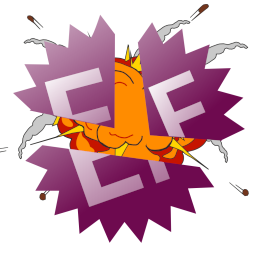

<div align="center">



# EazyDevirt

[EazyDevirt] is an open-source tool that automatically restores the original IL code from an assembly virtualized with [Eazfuscator.NET].

[Installation](#installation) •
[Usage](#usage) •
[Features](#features) •
[Roadmap](#roadmap) •
[Support](#support)

[](https://forthebadge.com)

[](https://opensource.org/licenses/)

</div>

## Usage
```
EazyDevirt <assembly> [<output>] [options]
```

```console
Arguments:
  <assembly>  Path to target assembly
  <output>    Path to output directory [default: ./eazydevirt-output]

Options:
  -v, --verbose <verbosity>  Level of verbosity [1: Verbose, 2: Very Verbose, 3: Very Very Verbose] [default: 0]
  --preserve-all             Preserves all metadata tokens [default: False]
  --no-verify                Don't verify labels or compute max stack for devirtualized methods [default: False]
  -kt, --keep-types          Keeps obfuscator types [default: False]
  --save-anyway              Saves output of devirtualizer even if it fails [default: False]
  --only-save-devirted       Only saves successfully devirtualized methods (This option only matters if you use the
                             save anyway option) [default: False]
  --version                  Show version information
  -?, -h, --help             Show help and usage information
```

#### Example:
```console
$ EazyDevirt.exe test.exe -v 3 --preserve-all --save-anyway true
```

### Notes
[Eazfuscator.NET] resolves members using names rather than tokens. 
This means renaming any member may break the application. 

[EazyDevirt] requires control flow and other protections (such as string encryption or delegate proxies) to be removed first.
To remove string encryption, you can use [EazFixer]. 

For control flow obfuscation, you can try using de4dot:
```console
$ de4dot <assembly> --only-cflow-deob
```

## Installation
To clone the project use:

```console
$ git clone --recurse-submodules https://github.com/puff/EazyDevirt.git
```

Then you can use your favourite IDE or build from the command line:

```console
$ dotnet restore
$ dotnet build
```

## Features
 - Automatically identify and map virtual opcodes to their CIL counterparts
 - Automatically identify devirtualize methods virtualized with [Eazfuscator.NET]
 - Emulated binary reader using [Echo]

## Roadmap
See the [open issues](https://github.com/puff/EazyDevirt/issues) for a list of proposed features (and known issues).

## Support
[EazyDevirt] is targeted at version 2022.2 of [Eazfuscator.NET]. 
If the version you're trying this tool on is not supported, you will need to add support for it yourself. You can take a look at the differences between the branches to see what you need to change.

I won't help you use this program. But, if you find a bug, feel free to submit an issue. 

### Credits
- [void-stack] for the many contributions.
- [saneki] for the [eazdevirt] project.
- [TobitoFatitoRE] for the [HexDevirt] project.
- [Washi1337] for the [AsmResolver] and [Echo] libraries.

And a thank you, to [all other contributors](https://github.com/puff/EazyDevirt/graphs/contributors). 

[EazyDevirt]:https://github.com/puff/EazyDevirt
[eazdevirt]:https://github.com/saneki/eazdevirt
[HexDevirt]:https://github.com/TobitoFatitoRE/HexDevirt
[TobitoFatitoRE]:https://github.com/TobitoFatitoRE
[void-stack]:https://github.com/void-stack
[saneki]:https://github.com/saneki
[Washi1337]:https://github.com/Washi1337
[AsmResolver]:https://github.com/Washi1337/AsmResolver
[Echo]:https://github.com/Washi1337/Echo
[Eazfuscator.NET]:https://www.gapotchenko.com/eazfuscator.net
[EazFixer]:https://github.com/holly-hacker/EazFixer
